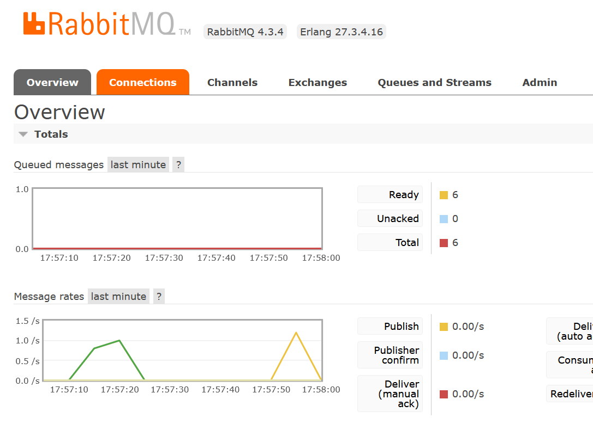
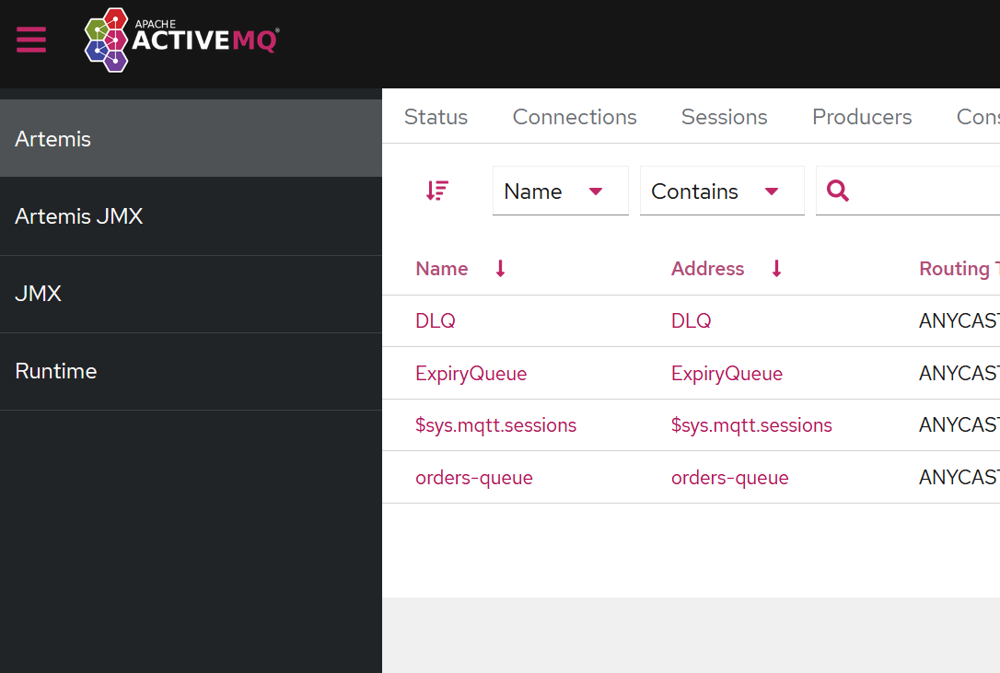

# Sandbox of different queues technologies

A small project for a basic set-up and learning of modern queue technologies like RabbitMQ, ActiveMQ, Kafka

## Technologies

- C#
- Docker
- RabbitMQ
- ActiveMQ
- Kafka

